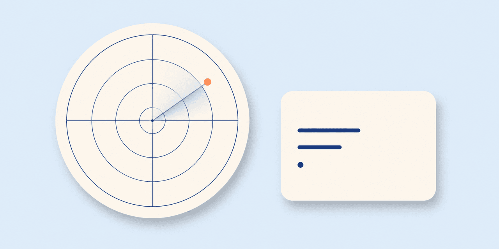
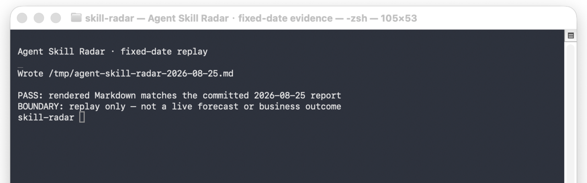

# Agent Skill Radar｜AI Agent 技能雷达

[English](README.md) · [固定日期案例](docs/cases/2026-08-25-fixed-date-radar.md) · [信号到简报案例](docs/cases/signal-to-build-brief.md) · [参与贡献](CONTRIBUTING.md)



> **一个小而可复现的 GitHub 研究循环：为 AI agent skills、MCP servers、prompts 和 agent-native developer tools 留下可回查的 build brief。**

从这里开始：运行下方的三分钟回放，再对照 [`2026-08-25` 固定日期报告](reports/2026-08-25.md) 与 [同日期数据](data/2026-08-25.json)。本项目不预测市场或商业结果；它保存一次研究判断依赖的公开证据，让读者可以检查、质疑或复用方法。

## 它做什么

Agent Skill Radar 把公开 GitHub 仓库与 issue 信号变成带日期的 build brief。

| 步骤 | 输入 | 输出 |
|---|---|---|
| 采集 | 已配置的 GitHub 搜索 query 与近期 issue 样本 | 带日期 JSON：仓库元数据、issue 样本、评分字段 |
| 评分 | 热度、活跃度、issue 需求、扩展性、创作者适配度、新颖度与饱和度 | 分数与工作阶段 |
| 渲染 | 一份采集 JSON | 双语 Markdown 报告、机会排序与证据链接 |
| 复核 | 报告、来源链接与本地语境 | 一个小实验、一次拒绝，或继续补证 |

分数只是研究辅助，不是预测、投资信号、市场规模、产品推荐，也不证明某个 build brief 必须变成产品。

## 三分钟回放

安装之后这一步不联网：它渲染已提交的固定日期数据，而不是假装用今天的 GitHub 状态重造历史。



这张截图记录 2026-08-25 的一次本地回放。它只支持“在这个环境中，已提交输入渲染成了与已提交报告一致的 Markdown”，不支持实时 GitHub 采集、趋势预测、采用量或商业结果。完整来源见[媒体登记](docs/evidence/media-register.yaml)。

```bash
git clone https://github.com/soarsky1991/skill-radar.git
cd skill-radar
python3 -m venv .venv
source .venv/bin/activate
python -m pip install -e .
agent-skill-radar report \
  --input data/2026-08-25.json \
  --out /tmp/agent-skill-radar-2026-08-25.md
```

打开 `/tmp/agent-skill-radar-2026-08-25.md`，并与 [已提交报告](reports/2026-08-25.md) 比较。二者来自同一份已提交数据，所以应保留相同的排序项目和证据链接。

要采集新的实时运行，请使用新的日期。此步骤需要 GitHub 访问；`GITHUB_TOKEN` 可选，但能提高 API 限额。

```bash
export GITHUB_TOKEN=github_token_here
agent-skill-radar run \
  --date "$(date -u +%F)" \
  --data-dir data \
  --report-dir reports
```

实时命令会写入 `data/<date>.json`、`reports/<date>.md`、`data/latest.json` 和 `reports/latest.md`。请先复核结果，再把任何排名项目当作值得继续研究的机会。

## 两个完整、可检查的案例

### 案例一：固定日期雷达运行

[`2026-08-25` 固定日期案例](docs/cases/2026-08-25-fixed-date-radar.md) 从 query 配置和 JSON 输入，一直追到渲染后的报告。它同时写清哪些内容可以在本地复现，哪些内容无法在事后重新构造，例如采集当时的外部 GitHub 状态。

### 案例二：信号如何变成 build brief

[信号到简报案例](docs/cases/signal-to-build-brief.md) 跟随报告中的 `addyosmani/agent-skills`：一次记录下来的分数和 issue 样本，如何导向一个边界清晰的构建角度。它展示信号如何变成“下一步要验证的问题”，而不是宣称该实验已经成功。

## 怎样阅读一份 build brief

一份合格简报应回答六件事：具体问题或开发者信号是什么；哪条公开仓库、issue、discussion 或 release 支持它；使用了哪些输入与评分字段；事实之后能导出什么窄范围研究/构建角度；最小、可逆的验证是什么；以及证据**不证明什么**。

最后一项如果缺失，简报就不完整。热度、一次近期提交或一个 issue thread，都不足以证明持久需求。

## 评分模型

- **热度**：公开可见的仓库关注信号。
- **活跃度**：公开元数据中的近期活动。
- **速度代理**：粗略 stars/day 代理，不是增长验证。
- **issue 需求**：采样的标题、评论与 reactions。
- **扩展性**：是否合理支持 skill、plugin、MCP、CLI、prompt 或 template。
- **创作者适配度**：是否值得做成有用的公开解释或 benchmark。
- **新颖度与饱和度**：帮助检查生态空位与拥挤程度。

`build-now`、`probe-this-week`、`content-first` 和 `archive` 都只是研究优先级标签，不是发布、付款、联系维护者或做商业承诺的指令。

## 证据与媒体

[媒体证据清单](docs/assets/README.md)与[机器可读登记](docs/evidence/media-register.yaml)明确区分真实终端回放和生成的 Social Preview。报告、JSON、配置与对外来源链接仍是主要证据；截图只让一次本地回放变得可见。

## 参与贡献

欢迎通过 [贡献说明](CONTRIBUTING.md) 推荐信号、质疑评分或改进 build brief。请使用 Issue 模板，附上公开证据，并明确说明建议**不能**证明什么。

## 相关公开工作

- [马智辰的 GitHub 主页](https://github.com/soarsky1991)
- [Evidence-First Patent Skill](https://github.com/soarsky1991/evidence-first-patent-skill)
- [XHS Cover Committee Skill](https://github.com/soarsky1991/xhs-cover-committee-skill)
- [rebuild-editable-ppt-from-image](https://github.com/soarsky1991/rebuild-editable-ppt-from-image)

## 许可

[MIT](LICENSE)
